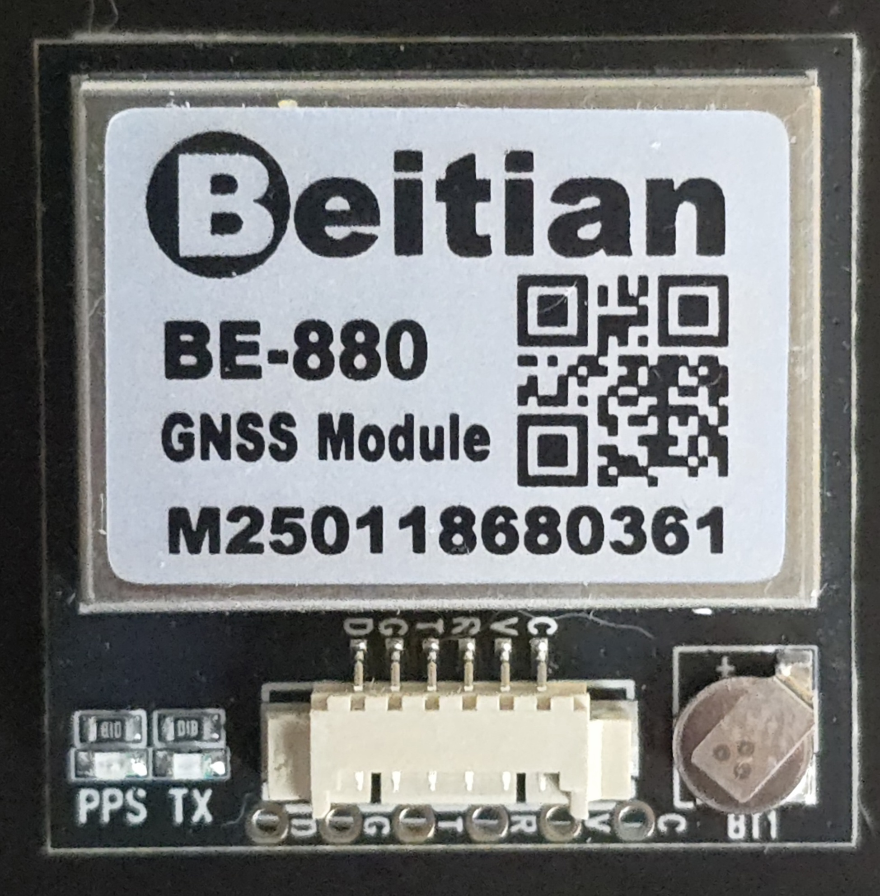
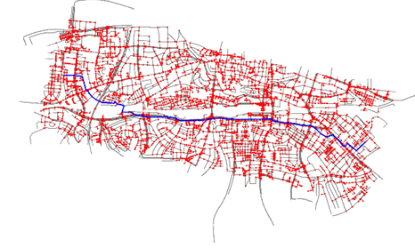

# Bike-Computer
Repository for my Bachelor's thesis:
Development and Optimization of a  Bike Computer with Navigation for  Embedded Systems

This is my Bachelor’s thesis project: a Raspberry Pi–based bicycle computer with built-in navigation. It calculates routes using OpenStreetMap data and shows directions on a small display. Everything’s coded in Python, with minimal libraries and a focus on making it work from scratch. Feel free to use or improve it however you like.

## Short Summary
### Introduction
In the age of smartphones, standalone navigation systems may seem obsolete at first glance. However, bicycles remain a niche where such devices still hold potential—especially in the open-source space. The goal of this project was to develop a bicycle computer with navigation capabilities, based on embedded systems and with minimal use of external libraries. The focus was placed on functionality, transparency, and technical inspiration for future students.

### Methods and Materials

The system is built from three main components:  
- A Raspberry Pi Zero 2 WH  
- A 1.44" LCD display with control buttons  
- A GNSS-capable GPS module  




Navigation data is sourced from OpenStreetMap and optimized for bike routes.  
Classic routing algorithms such as Dijkstra and A* were implemented for pathfinding, with graph theory playing a central role.  
The software was initially developed on Windows and later ported to the Raspberry Pi.



### Results
The developed device enables offline navigation based on a preloaded bicycle route. The route is not hard-coded and can be modified in the code. The routing logic works reliably, and the graphical interface clearly displays route layouts, turn instructions, and position data. Despite the limited performance of the Raspberry Pi, a functional and stable solution was achieved.


 


### Conclusion and Outlook

This work demonstrates that a fully functional bicycle computer can be created with simple means—independent of commercial solutions.  
Future versions could include features like a search function, energy-efficient routing for e-bikes, or smartphone connectivity to transfer preplanned routes.  
The project serves not only as a technical example of embedded navigation but also as an inspiration for further student developments at OTH Regensburg.

## Installation
```bash
git clone https://github.com/Buschti/Bike-Computer.git
cd Bike-Computer
python -m venv env
source env/bin/activate  # Linux/macOS
env\Scripts\activate     # Windows
pip install -r requirements.txt
```

## License
This project is licensed under the Unlicense. Use it however you want!

## Future Projects

Some ideas to build on this project:

- **Search Function**  
  Add a way to find places like stores or street names, and filter routes by surface type (like asphalt or gravel).

- **Smartphone Route Planning**  
  Let users plan trips on their phones (e.g. using Komoot), then send GPX files to the bike computer via Bluetooth.

- **Energy-Efficient Routing**  
  For e-bike users—calculate routes that save battery and show how much energy different paths use.
